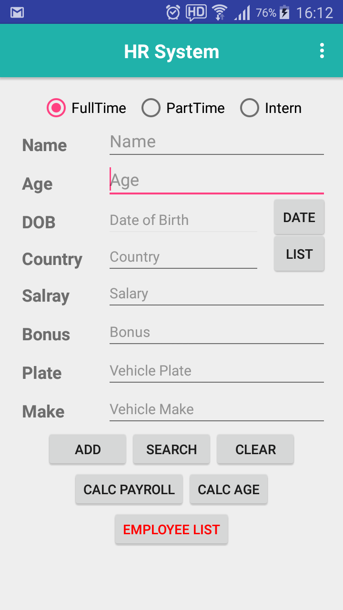
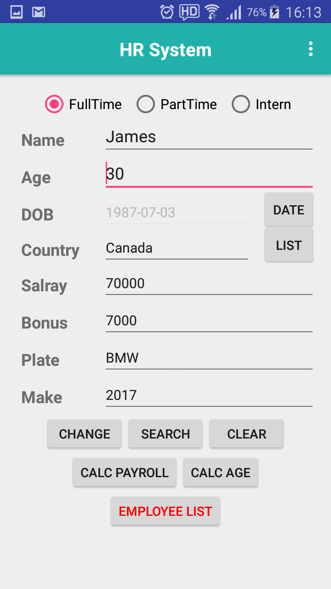
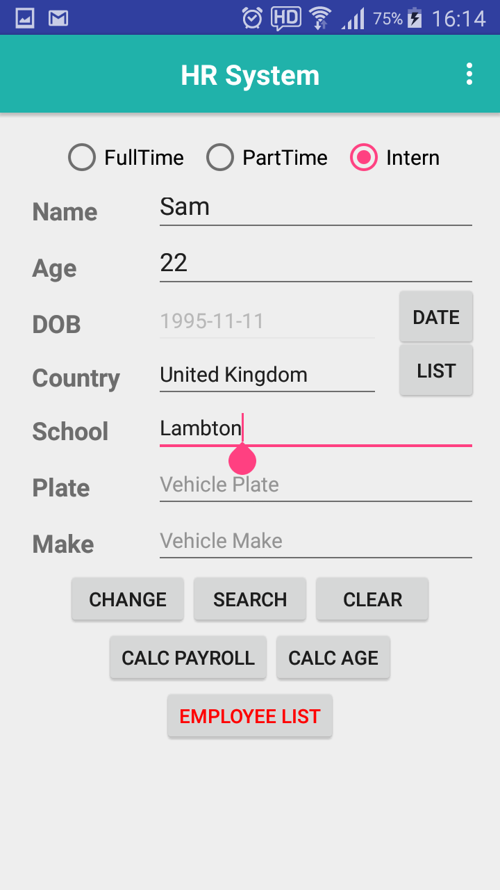

# Project Name : HRSysAndroidApp 

## Features

This is a personal project for implementing a Android app which manages Employee Information

- Add, Change and Delete Employee Information
- Calculation Payroll List / Employees' Age/DOB List

## Screenshot

  
  
  

  
  

